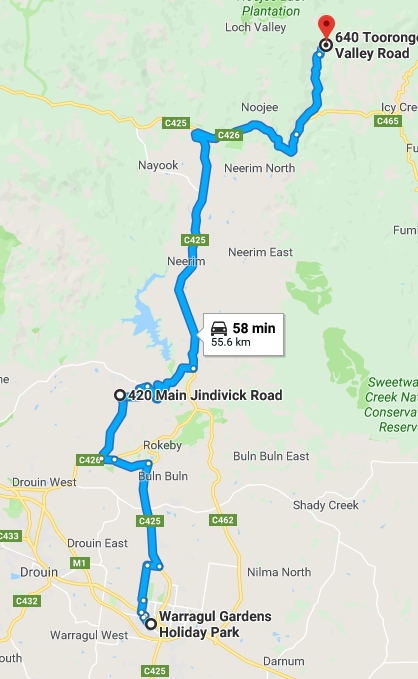
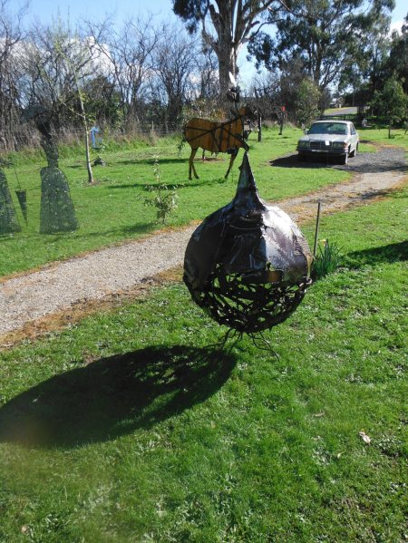
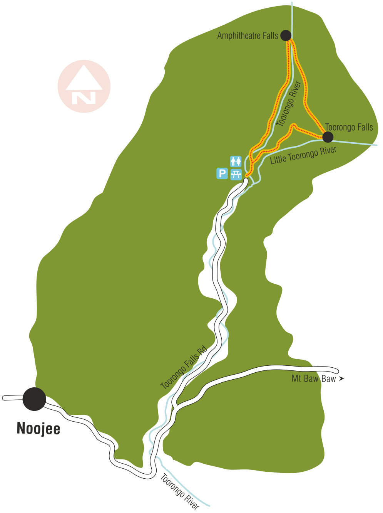
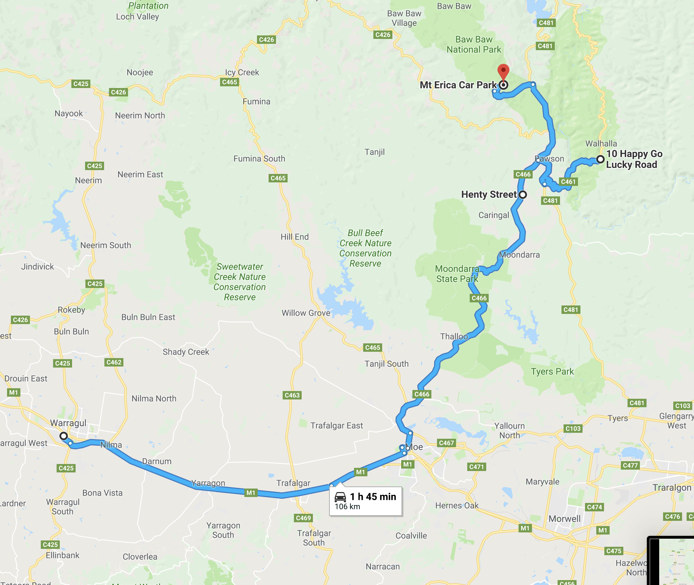
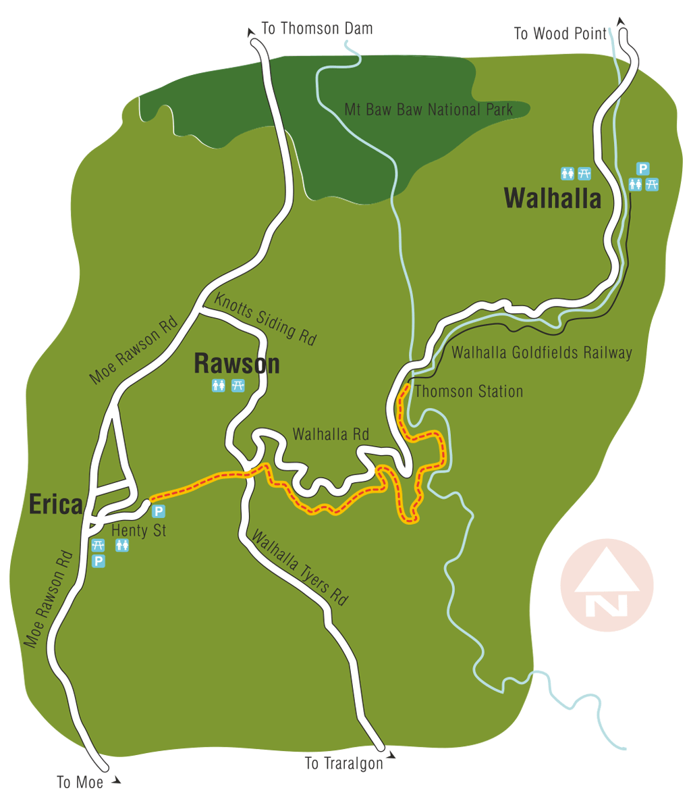
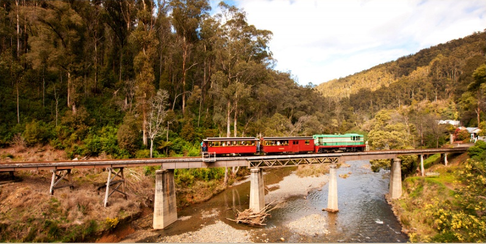
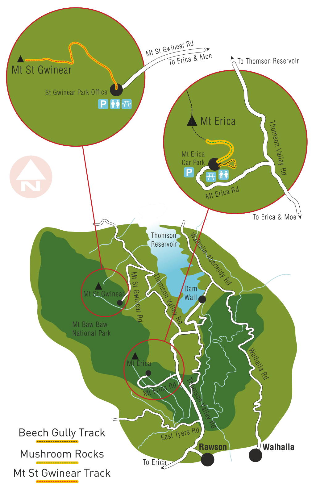

## Mount Baw Baw
## Accommodation
### Warragul Gardens Holiday Park
**Location**
44 Burke St, Warragul VIC 3820

## DAY 1

### Laurie Collins Sculpture Garden

**Location**
420 Main Jindivick Rd, Jindivick VIC 3818

### Toorongo Falls Reserve
**Location**
640 Toorongo Valley Rd, Noojee VIC 3833

## DAY 2

### Walhalla Goldfields Rail Trail
**Location**
Henty Street, Erica VIC

### Walhalla Goldfields Railway

* Sat 07 Jul 2018	
  * Walhalla 11:00am, 1:00pm
  * Thomson 11:40am, 1:40pm
* Sun 08 Jul 2018	
  * Walhalla 11:00am, 1:00pm
  * Thomson 11:40am, 1:40pm

[Railway Map](http://www.walhallarail.com.au/download/map/walhalla_rail_map_2011.pdf)

**Location**
10 Happy Go Lucky Rd, Walhalla VIC 3825

### Bawbaw national park

**Location**
Mt Erica Car Park

### Traralgon Antiques
**Location**
5 Leesons Rd, Traralgon VIC 3844

